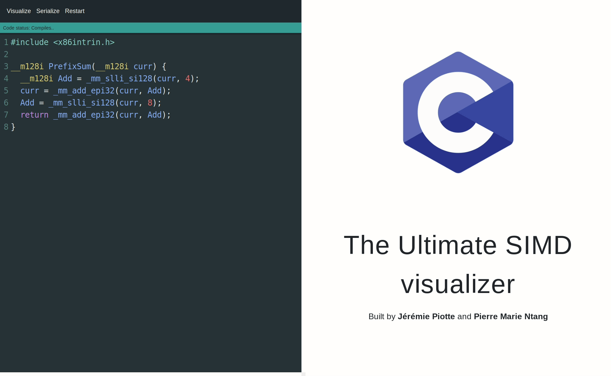

# Live Version found here (Proof of concept)
[http://piotte13.github.io/SIMD-Visualiser](http://piotte13.github.io/SIMD-Visualiser)


( This is a Prototype version, we are still in development! Thanks for your support  :-) 
# But wait, what is SIMD?
SIMD (pronounced "seem-dee") is short for **Single Instruction/Multiple Data** which is one [classification of computer architectures](https://en.wikipedia.org/wiki/Flynn%27s_taxonomy "classification of computer architectures"). SIMD allows one same operation to be performed on multiple data points resulting in data level parallelism and thus performance gains, for example for 3D graphics and video processing, physics simulations or cryptography, and other domains.

# Why would one need to visualize it?
The first time I saw SIMD code, I almost had a hearth attack.  My brain was overwhelmed, my stress level rose, my face turned white like a sheet of paper and cold sweats started to flow all over my body.  SIMD code is not designed to be easily understood by human brain, it's similar to assembly code, it's made for machines.

The thing is, we still need SIMD. It's powerful and once you understand what it does, it's quite simple. So, how do we understand what it does then?  We visualize it!  We make it look simple with animations, colors and graphics!

Our goal is to experiment with different visualization methods, until we figure out the ones that are so easy to understand that even our grandmothers would think it's a kids play. For now, we think we found a solution that allows anyone with basic computer science knowledge to understand any given SIMD code, quickly and free of hearth attacks. 

# Basic Features
- Graphical Visualization. 🔥🔥
- Abstract Syntax Tree (AST) 🌳🌱
- Write, compile and find bugs in SIMD code. 😮😍


# How does it work?
So, you are wondering how we made it, right? Did we hire a magician? Let's see... 😉

At first thought, parsing C code might seem like a trivial task. But it's not, it's actually laborious, painful and brain twisting...  C is a deeply complex language, therefore it cannot be parsed using only regular expressions, we need a lot more fancy techniques and effort.  In addition to that, there is no available C code parser written in JavaScript that we could directly use in our project.  At least, we did not find any.

Don't get me wrong, it's totally possible to make one, after all, any kind of compiler has to parse code before it can tweak it and do its thing.  That's where things get interesting, compilers like [Clang](https://clang.llvm.org/) already have an integrated parser, and a surprisingly good one, so why try and reinvent the wheel? Why not capitalize on what is already made and use it at our advantage? Well, that is for sure a good point... So, we tried using the compiler and it works like magic. It is fast, efficient and simple to use.

 Thanks to [Matt Godbolt](https://github.com/mattgodbolt/compiler-explorer) and his [Compiler Explorer](https://godbolt.org/), we were able to compile our SIMD code to assembly using any version of Clang through his free and open source REST API.  We also discovered that the Clang compiler can produce an [Abstract Syntaxic Tree](https://en.wikipedia.org/wiki/Abstract_syntax_tree) that we can later use as another visualization strategy.

Okay, now that we have compiled SIMD code, what do we do? 

 1. Parse it.
 2. Draw it.
 3. Animate it.

Although we skipped the C code parsing using Clang, we still need to parse the assembly code, or else it's useless to us.  One particularity of assembly code is that it's easy to parse. In JavaScript jargon, it's as simple as String.split(). But what about the complexity of the code, doesn't assembly add a lot of junk? Well, an interesting feature of compiled SIMD code is that it's quite simple, there is no additional complexity like we would find in assembly generated from traditional C code.

Here's an example: 

C code (SIMD):
``` 
#include <x86intrin.h>

__m128i PrefixSum(__m128i curr) {
	__m128i Add = _mm_slli_si128(curr, 4); 
	curr = _mm_add_epi32(curr, Add);   
	Add = _mm_slli_si128(curr, 8);    
	return _mm_add_epi32(curr, Add);       
} 
```

Assembly:
```
PrefixSum(long long __vector(2)):
	vpslldq xmm1, xmm0, 4
	vpaddd  xmm0, xmm1, xmm0
	vpslldq xmm1, xmm0, 8
	vpaddd  xmm0, xmm0, xmm1
	ret
```

Let me explain. The first column of every row represents the name of the command and the subsequent columns represent the arguments or parameters.  **xmm**, **ymm** and **zmm** arguments are registry addresses.  Essentially, registries are like the variables you would find in C, except there is a finite amount of them and there is no concepts such as scope and lifetime. The first letter (X, Y, Z) represents the size, which would be (128, 256, 512) bits and there is only 32 addresses of registries. Those characteristics makes registries easier to work with, compared to C variables, since a lot of complexity is therefore removed or taken care of by the compiler.  To learn more about AVX registry and it's commands, read [this](https://en.wikipedia.org/wiki/Advanced_Vector_Extensions#New_instructions). 

Now that we have parsed every command and their parameters, we can finally start drawing and animating them!  To do so, we used [React](https://reactjs.org/) as a JavaScript user interface library and [Anime.js](http://animejs.com/) for the animations.


# Development/Contributing
SIMD-Visualizer is a research project and for now, we are a small team! We actively encourage and support contributions. The SIMD-Visualizer source code is released under the BSD License. This license is very simple, and is friendly to all kinds of projects, whether open source or not. 

Feel free to fork and improve/enhance SIMD-Visualizer any way you want. If you feel that the application or the research team will benefit from your changes, please open a pull request.

## Available Scripts

In the project directory, you can run:
### `npm start`

Runs the app in the development mode.
Open [http://localhost:3000](http://localhost:3000) to view it in the browser.
The page will reload if you make edits.
You will also see any lint errors in the console.
### `npm run build`

Builds the app for production to the `build` folder.
It correctly bundles React in production mode and optimizes the build for the best performance.

The build is minified and the filenames include the hashes.
Your app is ready to be deployed!

### `npm run deploy`

Deploys application to github-pages.  It will build, then push the code to gh-pages branch.

### `npm test`

Launches the test runner in the interactive watch mode.
See the section about [running tests](#running-tests) for more information.

# Credits

This project is made possible by [Pierre Marie Ntang](https://github.com/pmntang).  It is part of his PhD thesis in congnitive computing at [Université du Québec (TELUQ)](https://www.teluq.ca/site/en/).  Many ideas came from his brilliant mind.

Thanks to [Daniel Lemire](https://github.com/lemire) for his many ideas and his deep knowledge and expertise in SIMD software.  He is well known in the open source world as well as the big data community. His work is used by companies such as eBay, Facebook, LinkedIn and Netflix in their data warehouses. Git also uses his techniques to accelerate queries.

Big thanks to [Matt Godbolt](https://github.com/mattgodbolt/compiler-explorer) for his free and open source REST API of the [Compiler Explorer](https://godbolt.org/), which allows us to use Clang and many other compilers from the browser.


# License
The [BSD 3-clause](https://tldrlegal.com/license/bsd-3-clause-license-(revised)) license allows you almost unlimited freedom with the software so long as you include the BSD copyright and license notice in it (found in Fulltext).
